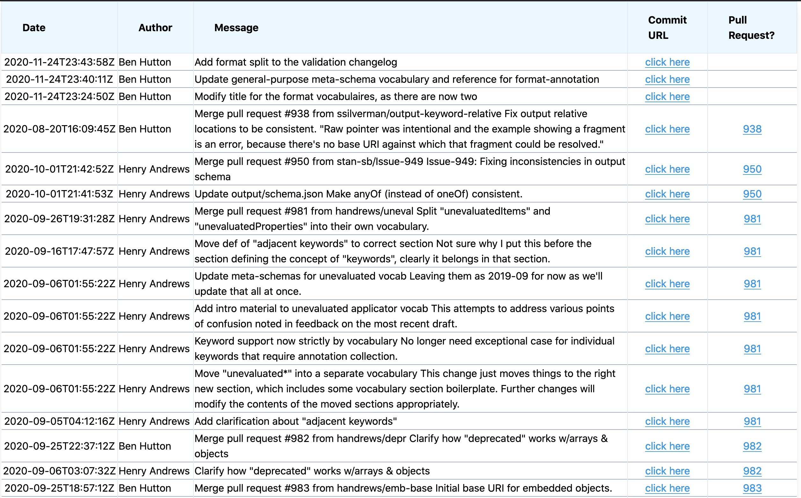

# JSON Schema Changelog Script

Purpose of this project is to have a script that can get a list of changes done to JSON Schema specification after 2019-09-01, to spend less time on changelong creation.

So far script is hardcoded for this specific use case for JSON Schema. I cannot belive someone else would need it really.

## What It Produces?

It produces two files, `index.html` and `excluded.html`. The first one contains the list of commits that are good candidates for review for the changelog. The second one contains commits that were excluded from review.

## Usage

### Requirements

Get GitHub personal access token. You do not need any specific scopes for the token. Use [this](https://docs.github.com/en/free-pro-team@latest/github/authenticating-to-github/creating-a-personal-access-token) instruction.

